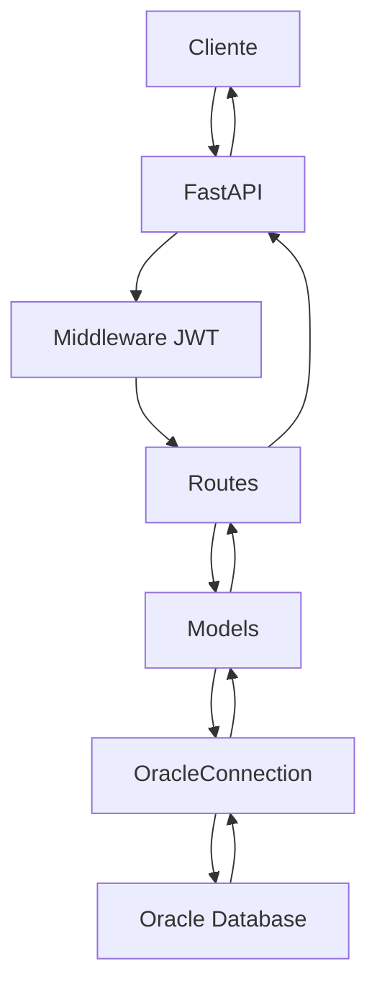

# API Winthor

## 📋 Visão Geral

A **API Winthor** é uma aplicação FastAPI desenvolvida para fornecer acesso seguro e eficiente aos dados do sistema Winthor através de uma interface REST. Esta API permite consultar informações de clientes e outros dados do ERP Winthor de forma estruturada e autenticada.

### 🎯 Objetivos

- **Integração Segura**: Fornecer acesso controlado aos dados do Winthor
- **Performance**: Utilizar connection pooling para otimizar consultas
- **Escalabilidade**: Arquitetura baseada em FastAPI para alta performance
- **Segurança**: Sistema de autenticação JWT robusto
- **Monitoramento**: Logging detalhado para auditoria e debugging

## 🏗️ Arquitetura

### Componentes Principais

```
📁 Producao/ApiWinthor/
├── 📄 main.py                 # Ponto de entrada da aplicação
├── 📁 connection/            # Camada de conexão com banco
│   ├── 📄 oracle_conn.py     # Gerenciamento de conexões Oracle
│   └── 📄 ojdbc17.jar        # Driver JDBC Oracle
├── 📁 environment/           # Configurações de ambiente
│   ├── 📄 config.py          # Carregamento de variáveis
│   └── 📄 .envexample        # Template de configuração
├── 📁 models/                # Camada de dados
│   └── 📄 model.py           # Modelos e consultas SQL
├── 📁 routes/                # Endpoints da API
│   ├── 📄 route.py           # Rotas de cliente
│   ├── 📄 token.py           # Rotas de autenticação
│   └── 📄 user.py            # Rotas de usuário
├── 📁 security/              # Segurança e autenticação
│   └── 📄 auth.py            # Sistema JWT
└── 📁 logger/                # Sistema de logs
    └── 📄 setup_logger.py    # Configuração de logging
```

### Fluxo de Dados



## 🚀 Instalação e Configuração

### Pré-requisitos

- **Python 3.8+**
- **Java Runtime Environment (JRE)** 8 ou superior
- **Oracle Database** com driver JDBC
- **Oracle Client** (opcional, mas recomendado)

### 1. Instalação das Dependências

```bash
# Criar ambiente virtual
python -m venv venv
source venv/bin/activate  # Linux/Mac
# ou
venv\Scripts\activate     # Windows

# Instalar dependências
pip install fastapi uvicorn python-jose[cryptography] passlib[bcrypt] python-dotenv jaydebeapi jpype1
```

### 2. Configuração do Ambiente

1. **Copie o arquivo de exemplo:**
```bash
cp environment/.envexample environment/.env
```

2. **Configure as variáveis no arquivo `.env`:**

```env
# Configurações do Oracle
ORACLE_USER='seu_usuario_oracle'
ORACLE_PASSWORD='sua_senha_oracle'
ORACLE_SERVICE='nome_do_servico'
ORACLE_HOST='host_do_banco'
ORACLE_PORT='porta_do_banco'
JDBC_PATH='connection/ojdbc17.jar'
JDBC_DRIVER='oracle.jdbc.driver.OracleDriver'

# Configurações de Segurança
SECRET_KEY="sua-chave-secreta-muito-forte-aqui"
ALGORITHM="HS256"
ACCESS_TOKEN_EXPIRE_MINUTES=99
```

### 3. Configuração do Banco de Dados

Certifique-se de que:
- O banco Oracle está acessível
- As credenciais estão corretas
- O arquivo `ojdbc17.jar` está no caminho especificado
- O usuário tem permissões para consultar as tabelas necessárias

## 🔐 Sistema de Autenticação

### Usuários Disponíveis

Atualmente, o sistema possui um usuário pré-configurado:

- **Username:** `testuser`
- **Password:** `teste$$user`
- **Role:** `admin`

### Como Funciona

1. **Login:** POST `/token` com username e password
2. **Token JWT:** Recebe token de acesso válido por 99 minutos
3. **Autenticação:** Todas as rotas protegidas requerem o header `Authorization: Bearer <token>`

### Exemplo de Login

```bash
curl -X POST "http://localhost:8000/token" \
     -H "Content-Type: application/x-www-form-urlencoded" \
     -d "username=joselucas&password=jose$$lucas"
```

**Resposta:**
```json
{
  "access_token": "eyJhbGciOiJIUzI1NiIsInR5cCI6IkpXVCJ9...",
  "token_type": "bearer"
}
```

## 📡 Endpoints da API

### Base URL
```
http://localhost:8000
```

### Autenticação

#### POST `/token`
**Obter token de acesso**

- **Método:** POST
- **Content-Type:** application/x-www-form-urlencoded
- **Parâmetros:**
  - `username` (string): Nome do usuário
  - `password` (string): Senha do usuário

**Resposta de Sucesso (200):**
```json
{
  "access_token": "token_jwt_aqui",
  "token_type": "bearer"
}
```

**Resposta de Erro (400):**
```json
{
  "detail": "Usuário ou senha inválidos"
}
```

### Cliente

#### GET `/info/client`
**Consultar informações de cliente**

- **Método:** GET
- **Autenticação:** Bearer Token (obrigatório)
- **Parâmetros de Query:**
  - `codcli` (int): Código do cliente (obrigatório, deve ser > 0)

**Exemplo de Requisição:**
```bash
curl -X GET "http://localhost:8000/info/client?codcli=123" \
     -H "Authorization: Bearer seu_token_aqui"
```

**Resposta de Sucesso (200):**
```json
{
  "user": "joselucas",
  "data": [
    {
      "CODCLI": 123,
      "CLIENTE": "Nome do Cliente",
      "FANTASIA": "Nome Fantasia",
      "CGC": "00.000.000/0001-00",
      "ENDERECO": "Rua Exemplo, 123",
      "BAIRRO": "Centro",
      "CIDADE": "São Paulo",
      "UF": "SP",
      "CEP": "00000-000",
      "TELEFONE": "(11) 9999-9999",
      "EMAIL": "cliente@email.com"
    }
  ]
}
```

**Respostas de Erro:**

- **400 Bad Request:** Código inválido
```json
{
  "detail": "Código inválido"
}
```

- **401 Unauthorized:** Token inválido ou expirado
```json
{
  "detail": "Token inválido ou expirado"
}
```

- **404 Not Found:** Cliente não encontrado
```json
{
  "detail": "Cliente não encontrado"
}
```

- **500 Internal Server Error:** Erro interno do servidor
```json
{
  "detail": "Erro interno no servidor"
}
```

### Usuário

#### GET `/me`
**Informações do usuário autenticado**

- **Método:** GET
- **Autenticação:** Bearer Token (obrigatório)

**Resposta de Sucesso (200):**
```json
{
  "username": "joselucas",
  "full_name": "José Lucas Guimarães Costa",
  "role": "admin"
}
```

## 🗄️ Estrutura do Banco de Dados

### Tabela Principal: `VW_FXON_SQL_PORTALCLIENTE`

Esta view contém as informações dos clientes consultadas pela API:

```sql
SELECT * FROM VW_FXON_SQL_PORTALCLIENTE WHERE CODCLI = ?
```

**Campos principais:**
- `CODCLI`: Código do cliente (chave primária)
- `CLIENTE`: Razão social
- `FANTASIA`: Nome fantasia
- `CGC`: CNPJ/CPF
- `ENDERECO`: Endereço completo
- `BAIRRO`: Bairro
- `CIDADE`: Cidade
- `UF`: Estado
- `CEP`: CEP
- `TELEFONE`: Telefone
- `EMAIL`: E-mail

## ⚙️ Configuração Avançada

### Connection Pool

O sistema utiliza um pool de conexões JDBC configurado com:

- **Pool mínimo:** 2 conexões
- **Pool máximo:** 10 conexões
- **Gerenciamento automático:** Conexões são reutilizadas e liberadas automaticamente

### Logging

O sistema de logging está configurado para:

- **Nível:** INFO
- **Formato:** `%(asctime)s - %(levelname)s - %(message)s`
- **Saída:** Console

**Exemplos de logs:**
```
2024-01-15 10:30:15,123 - INFO - ✅ JVM iniciada com sucesso para JDBC.
2024-01-15 10:30:15,124 - INFO - 🔵 Pool JDBC criado com 2 conexões.
2024-01-15 10:30:15,125 - WARNING - ⚠️ Pool vazio, criando nova conexão JDBC.
2024-01-15 10:30:15,126 - ERROR - ❌ Erro ao executar query JDBC: [detalhes do erro]
```

## 🚀 Executando a Aplicação

### Desenvolvimento

```bash
# Ativar ambiente virtual
source venv/bin/activate

# Executar com reload automático
uvicorn main:app --reload --host 0.0.0.0 --port 8000
```

### Produção

```bash
# Usando Uvicorn
uvicorn main:app --host 0.0.0.0 --port 8000 --workers 4

# Ou usando Gunicorn
gunicorn main:app -w 4 -k uvicorn.workers.UvicornWorker --bind 0.0.0.0:8000
```

### Verificação de Saúde

```bash
# Testar conexão com o banco
curl -X GET "http://localhost:8000/health"  # Se implementado

# Ver documentação interativa
open http://localhost:8000/docs  # Swagger UI
open http://localhost:8000/redoc  # ReDoc
```

## 🧪 Testes

### Teste de Conexão

```python
from models.model import Model

# Testar conexão
result = Model.try_connection()
print("Conexão OK!" if result else "Erro na conexão!")
```

### Teste de Autenticação

```bash
# 1. Obter token
TOKEN=$(curl -s -X POST "http://localhost:8000/token" \
     -H "Content-Type: application/x-www-form-urlencoded" \
     -d "username=joselucas&password=jose$$lucas" | jq -r '.access_token')

# 2. Testar endpoint protegido
curl -X GET "http://localhost:8000/info/client?codcli=1" \
     -H "Authorization: Bearer $TOKEN"
```

## 🔧 Manutenção e Troubleshooting

### Problemas Comuns

#### 1. Erro de Conexão JDBC
```
❌ Erro ao criar conexão JDBC
```
**Soluções:**
- Verificar credenciais do Oracle
- Confirmar se o arquivo `ojdbc17.jar` existe
- Verificar conectividade com o banco
- Confirmar se a JVM está funcionando

#### 2. Erro de Autenticação
```
Token inválido ou expirado
```
**Soluções:**
- Verificar se o token não expirou (99 minutos)
- Confirmar formato do header Authorization
- Verificar se o usuário existe

#### 3. Cliente Não Encontrado
```
Cliente não encontrado
```
**Soluções:**
- Verificar se o código do cliente existe na base
- Confirmar se a view `VW_FXON_SQL_PORTALCLIENTE` está acessível
- Verificar permissões do usuário no banco

### Monitoramento

#### Logs Importantes
- **INFO:** Operações normais do sistema
- **WARNING:** Situações que requerem atenção
- **ERROR:** Erros que impedem o funcionamento

#### Métricas a Monitorar
- Tempo de resposta das consultas
- Taxa de sucesso das autenticações
- Utilização do pool de conexões
- Erros de conexão com o banco

## 📚 Referências

### Tecnologias Utilizadas

- **FastAPI:** Framework web moderno e rápido para APIs
- **Oracle JDBC:** Driver para conexão com Oracle Database
- **JayDeBeApi:** Ponte entre Python e JDBC
- **JPype:** Integração Python-Java
- **Python-JOSE:** Implementação JWT para Python
- **PassLib:** Biblioteca de hashing de senhas

### Documentação Oficial

- [FastAPI Documentation](https://fastapi.tiangolo.com/)
- [Oracle JDBC Documentation](https://docs.oracle.com/en/database/oracle/oracle-database/)
- [JWT.io](https://jwt.io/)
- [Python-JOSE](https://python-jose.readthedocs.io/)

## 🤝 Contribuição

Para contribuir com o projeto:

1. Fork o repositório
2. Crie uma branch para sua feature (`git checkout -b feature/nova-feature`)
3. Commit suas mudanças (`git commit -am 'Adiciona nova feature'`)
4. Push para a branch (`git push origin feature/nova-feature`)
5. Abra um Pull Request

## 📄 Licença

Este projeto está sob a licença MIT. Veja o arquivo `LICENSE` para mais detalhes.

## 📞 Suporte

Para suporte técnico ou dúvidas:

- **E-mail:** suporte@empresa.com
- **Telefone:** (11) 9999-9999
- **Documentação Técnica:** Consulte os comentários no código fonte

---

**Última atualização:** Janeiro 2024
**Versão:** 1.0.0
**Mantenedor:** José Lucas Guimarães Costa
